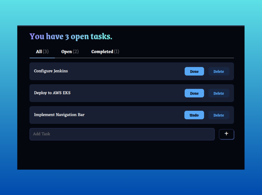

# 📝 React + LocalStorage Todo App

A simple and elegant task management (todo) app built with **React** and **LocalStorage**.

## ✨ Features

- ✅ Add new tasks
- 📌 Mark tasks as completed or undo
- 🗑️ Delete tasks
- 🔍 Filter tasks by:
  - All
  - Open
  - Completed
- 💾 Tasks persist in browser using `localStorage`
- 📊 Dynamic header: "You have X open task(s)"

## 📸 Screenshot

